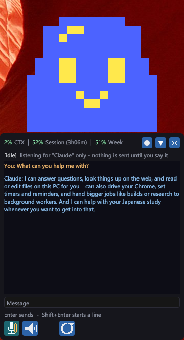
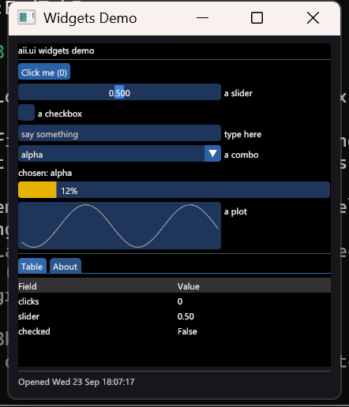
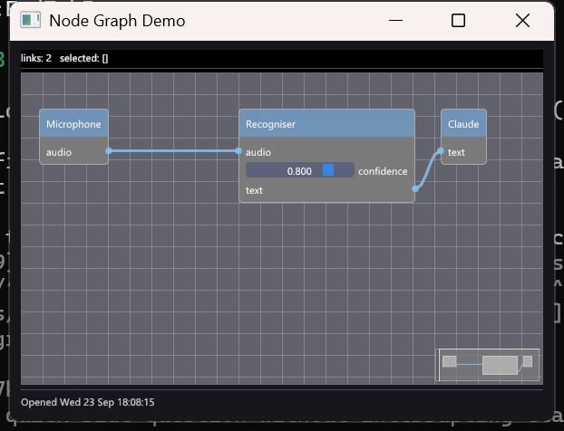

# AIInterface

A voice assistant for Windows 11 that talks to Claude. It is a small transparent window
that sits in the corner of your screen with a pixel avatar, a transcript and three buttons:
Talk, Silence and Pause. You speak, it listens, Claude answers, and the answer is spoken
back to you in English or Japanese.

Everything that hears and speaks runs on your own CPU. Claude runs through the Claude Code
command-line tool on your own subscription, so there is no API key, and nothing you say
goes anywhere except to Claude. No audio is ever written to disk.

<p align="center"></p>

What it can do:

- Hold a spoken conversation in English, Japanese or a mix of both, and answer in kind.
- Be interrupted. Talk over it and it stops and listens.
- Remember things you ask it to remember, across restarts.
- Start background workers: separate Claude sessions that read, write and run commands in
  a folder you name, and report back when they are done.
- Open small windows of its own, built from Python scripts it writes, to show you things.
- Drive your Chrome browser, if you turn that on.

The windows it draws come from a small Python toolkit: buttons, sliders, tables, plots,
tabs, node graphs and more, each a one-line call. These two are the shipped examples.

<p align="center"> </p>

## What you need

- Windows 11 on a 64-bit PC. No particular graphics card is needed.
- A microphone and speakers, or a headset. A headset is the better experience, because
  the assistant's own voice then cannot reach the microphone.
- A Claude subscription and the [Claude Code](https://claude.com/claude-code) command-line
  tool, installed and signed in.
- About 2 GB of disk for the speech engines and models, which are downloaded once.

To build it you also need, each installed the normal way from its own site:

- [Git](https://git-scm.com/download/win)
- [Visual Studio 2022](https://visualstudio.microsoft.com/) with the "Desktop development
  with C++" workload
- [CMake](https://cmake.org/download/) 3.24 or newer
- [Vulkan SDK](https://vulkan.lunarg.com/sdk/home), for its shader compiler

## Setting it up

Open PowerShell and run these in order.

**1. Get the code.** The rendering engine comes along as a submodule, so clone with the
flag that fetches submodules too:

```
git clone --recurse-submodules https://github.com/0xen/AIInterface.git
cd AIInterface
```

If you already cloned without that flag, this fetches the missing part:

```
git submodule update --init --recursive
```

**2. Fetch the speech engines and models.** This script downloads about 1.3 GB from the
publisher of each component, puts every file where the build expects it, and then checks
that everything the app will look for is present. It is safe to run again if it stops
part way:

```
powershell -ExecutionPolicy Bypass -File scripts\setup.ps1
```

It also tells you if Visual Studio, CMake, the Vulkan SDK or Claude Code are missing, with
a link for each. It does not install them for you.

**3. Build.**

```
cmake -S . -B build -G "Visual Studio 17 2022" -A x64
cmake --build build --config Release
```

**4. Run.**

```
build\bin\Release\avatar.exe
```

A window appears in the bottom-right corner while the engines load, and the avatar comes
in when they are ready. Press SPACE or click the microphone button, say something, and
press SPACE again to send it.

To check the install without a microphone, this sends one typed message through the whole
pipeline and speaks the reply:

```
build\bin\Release\avatar.exe --say "Hello, what can you do?"
```

## Using it

| Do this | To |
|---|---|
| SPACE, or the microphone button | Start listening. Press again to stop and send. |
| Talk over it | Interrupt a reply. It stops speaking and listens to you. |
| Type, then Enter | Send a typed message instead of speaking. |
| S, or the speaker button | Mute its voice. Replies still arrive as text. |
| E, or the stop button | Cancel the reply and pause every worker. |
| The reset button | Forget the conversation and start a new one. |
| Esc or Q | Quit. |

Ask it in words for the rest: to remember something, to start a worker in a folder, to
open a window showing something, to clear the chat, to change its voice, or what is new
in this version.

## Making it yours

The file `pre-prompt.md` next to the executable is the assistant's personality. It is
plain text: describe how you want it to talk and what it should and should not do, and
the change takes effect on the next start.

Settings such as the model, the languages, the voice and whether it listens on startup
live in the settings panel inside the app, and in `%APPDATA%\AIInterface\settings.json`.
The assistant's own instructions are text files under `%APPDATA%\AIInterface\prompts\`
and can be read and edited there.

## Going further

The [full guide](docs/GUIDE.md) covers everything else: every control and flag, how
interruption works, the voices and how to add more, background workers and what they are
allowed to do, browser control, fetching the engines by hand, every environment variable,
the development builds and tests, and how a turn flows through the pipeline.

The design notes in `docs/` describe how the larger pieces are built: the script system,
the script windows, and the inline directive channel the assistant uses to control the app
from inside a reply.

## Licence

This repository is published to show the work. It is under the
[PolyForm Strict License 1.0.0](LICENSE): you are welcome to read the code and build
and run it for noncommercial purposes, but not to distribute it, modify it or build
products on it. Pull requests are not being taken. The rendering engine it uses is
published under the same terms.

The components the setup script downloads each carry their own licence: sherpa-onnx and
Kokoro are Apache-2.0, the Nemotron recogniser is under NVIDIA's OpenMDW licence,
VOICEVOX Core is MIT and its voices carry the VOICEVOX terms, which ask that the character
be credited (for example "VOICEVOX:四国めたん"). The [full guide](docs/GUIDE.md) has the
complete table.
